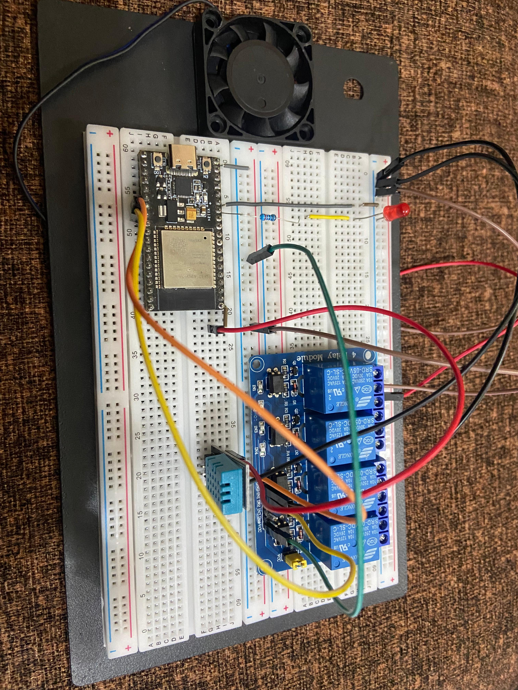
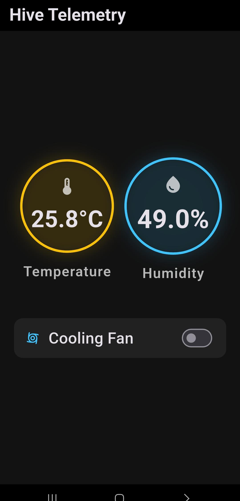
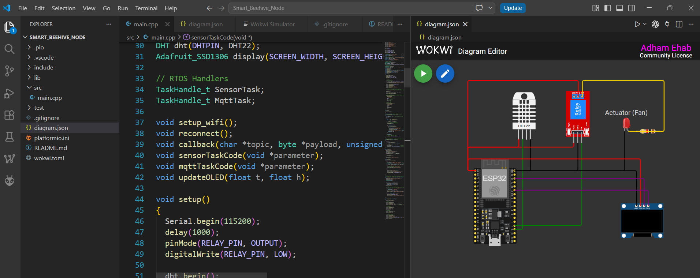

# Smart Beehive IoT Node & Telemetry Dashboard 🐝

## 📖 Project Overview
This project is an industrial-grade IoT edge device prototype paired with a custom mobile application. It is designed to track hive health and environmental conditions, utilizing a multi-tasking edge architecture for high-frequency local feedback, while synchronizing with the cloud for remote monitoring and actuation.

---

## 🛠️ Part 1: Hardware & Mobile Application
This section covers the physical implementation of the node, the actuator logic, and the user-facing mobile dashboard.

### **Physical Hardware**


* **MCU & Sensors:** Built around the physical ESP32 MCU, utilizing a DHT22 (One-Wire) for environmental sensing.
* **Actuation (Cooling Fan):** Integrates a 5V relay module to physically toggle a cooling fan based on telemetry thresholds or remote user commands.

### **📱 Mobile App Dashboard**


* **Cross-Platform UI:** A custom **Flutter (Dart)** application providing a responsive, real-time interface for monitoring telemetry.
* **Two-Way Cloud Sync:** Leverages **Firebase Realtime Database** to allow users to monitor data and manually toggle the physical cooling fan relay directly from their Android smartphone.

**Running the Mobile App:**
To run the Flutter telemetry dashboard on a physical Android device:
1. Navigate to the app directory: `cd Hardware_Implementation/Mobile_App/hiveapp`
2. Ensure your Android SDK and `platform-tools` are in your system `PATH`.
3. Connect your Android device via USB or Wireless Debugging.
4. Run the app:
   ```bash
   flutter run
   ```
*(Note: Requires a valid `google-services.json` file in the `android/app` directory to authenticate with Firebase).*

---

## 💻 Part 2: Firmware Simulation & Cloud Pipeline
This section covers the embedded software architecture, the messaging protocols, and the virtual simulation environment.



### **Features & Architecture**
* **Development Environment:** Firmware developed using **C++** within **VS Code** and the **PlatformIO** extension.
* **Multithreaded Edge Execution:** Utilizes **FreeRTOS** to completely decouple tasks. Sensor sampling and local UI updates (using a simulated 128x64 SSD1306 OLED via I2C) run on a fast loop (500ms), while network operations and MQTT publishing run independently (5s) to prevent blocking.
* **Industrial Messaging:** Communicates securely via **MQTT over TLS (Port 8883)** to a private **HiveMQ** Cloud cluster, maintaining a continuous, low-latency data pipeline.
* **Virtual Prototyping:** The entire embedded system architecture was verified in a simulated environment before physical deployment.

### **🔗 Live Simulation**
You can view, test, and modify the underlying embedded RTOS logic in a completely virtual environment. 

[**Click here to view and run the ESP32 simulation on Wokwi**](https://wokwi.com/projects/463757426410822657)

---

## 📁 Repository Structure
```text
Smart_Beehive_Node/
├── Firmware/
│   ├── src/main.cpp       # Main ESP32 logic and FreeRTOS tasks
│   ├── platformio.ini     # PlatformIO dependency and build settings
│   └── diagram.json       # Wokwi simulation configuration
└── Hardware_Implementation/
    └── Mobile_App/
        └── hiveapp/       # Flutter application source code
            ├── lib/main.dart # Mobile UI and Firebase logic
            └── pubspec.yaml  # Flutter dependencies
```
